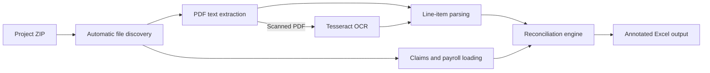

# Claims Checker

Claims Checker is a Python-based reconciliation tool that compares claim records against invoices, receipts, payroll data, and other supporting documents. It turns a manual document-review process into a structured exception workflow by extracting evidence from PDFs, matching it to claim lines, and returning an annotated Excel workbook for review.

The project includes a Streamlit interface for non-technical users and a command-line interface for repeatable or advanced runs.

## Why I built it

Claims checking is often repetitive: reviewers need to open many documents, locate reference numbers and amounts, compare them with a claims report, and record exceptions. This project automates the first-pass review while keeping a human in control of ambiguous cases.

It demonstrates my ability to translate a real operational workflow into a usable software tool, including document extraction, matching logic, exception handling, desktop setup, and user documentation.

## What it does

- Accepts one ZIP containing a claims workbook and its supporting files.
- Automatically discovers claims, payroll, PDF, Excel, and optional Outlook `.msg` files.
- Extracts text and line items from text-based PDFs.
- Falls back to Tesseract OCR for scanned or image-based documents.
- Detects document references, dates, descriptions, currencies, and amounts across varied layouts.
- Reconciles claim lines using document identifiers, amount tolerances, and normalized description similarity.
- Handles document-total matches, GST gross-up matches, offsetting entries, and claim-period filtering.
- Optionally reconciles end-of-month claims against payroll and transport totals against supporting spreadsheets.
- Produces a review-ready Excel file with the matched PDF description and a clear result for each row.

## Workflow



The matching engine is deliberately exception-oriented. Strong matches are marked `OK`; uncertain or missing evidence is surfaced as `FLAG` or `NO_MATCH` for a reviewer instead of being silently accepted.

## Output

The main result is:

```text
result.claims_with_comments.xlsx
```

It contains the claims data plus two columns:

| Column | Purpose |
| --- | --- |
| `Description_pdf` | Shows the description or supporting PDF associated with the claim line. |
| `comments` | Explains the reconciliation result and any action required. |

Common results include:

| Result | Meaning | Reviewer action |
| --- | --- | --- |
| `OK` | Supporting evidence and claim values match. | No action required. |
| `OK (GROSSUP MATCH)` | The value matches after applying the configured GST gross-up factor. | Optional spot check. |
| `FLAG` | A possible match was found, but the amount or description needs review. | Compare the claim with the source document. |
| `NO_MATCH` | No sufficiently reliable match was found. | Check the reference, value, and supporting files. |
| `NO_MATCH, MISSING SUPPORTING DOCS` | The expected supporting document was not present. | Request or add the missing document. |
| `Outside of claim period` | The row falls outside the selected date range. | Exclude or investigate as appropriate. |

When run from the command line, the tool also creates a detailed `.check.xlsx` diagnostic workbook.

## Example input structure

```text
claims-project.zip
├── claims-report.xlsx
├── payroll-schedule.xlsx          # optional
├── payroll-password.msg           # optional
├── supporting-documents/
│   ├── INV-1000123.pdf
│   ├── PO-1000456.pdf
│   └── transport-summary.xlsx     # optional
└── additional-support.zip         # nested ZIPs are extracted automatically
```

The claims file must contain description-like and amount-like columns. The tool scans for the real header row and recognizes common alternatives such as `Description`, `Short Text`, and columns beginning with `Amount`. Including document references in both the claims file and supporting filenames improves matching precision.

## Running the app on Windows

### One-time setup

1. Open the [`Claims_Checker`](Claims_Checker) folder.
2. Run `setup_employee_laptop.bat`.
3. Allow the script to install Python 3.10, create `.venv310`, install the Python packages, and install or locate Tesseract OCR.

Tesseract is optional for text-based PDFs but required for reliable processing of scanned documents.

### Start the application

Double-click:

```text
run_app.bat
```

Then:

1. Enter the document and date column names if needed.
2. Optionally select a claim-period start and end date.
3. Upload the project ZIP.
4. Select **Start reconciliation**.
5. Download the completed Excel workbook.

## Command-line usage

From the `Claims_Checker` directory, activate the environment and run:

```powershell
.\.venv310\Scripts\Activate.ps1
python test2_copy.py `
  --auto-input "C:\path\to\project-folder" `
  --out "C:\path\to\project-folder\out\result" `
  --doc-col "Document No." `
  --price-tol 0.05
```

Useful options include:

- `--claim-start` and `--claim-end` for an inclusive date range.
- `--claims-date-col` to select the claims date column.
- `--price-tol-abs` or `--price-tol-pct` to configure amount tolerance.
- `--require-doc-match` to disable description-only fallback matching.
- `--grossup` to change the tax gross-up factor; the default is `1.09`.
- `--docno-mode` to customize how references are extracted from filenames.
- `--keep-debug` to retain OCR and text-extraction artifacts for troubleshooting.

Run `python test2_copy.py --help` for the complete option list after installing the dependencies.

## Tech stack

- **Python 3.10** for the processing pipeline
- **Streamlit** for the browser-based interface
- **pandas** and **openpyxl** for spreadsheet ingestion and output
- **PyMuPDF** and **pypdf** for PDF processing
- **Tesseract OCR** and **pytesseract** for scanned documents
- **msoffcrypto-tool** for encrypted payroll workbooks
- **extract-msg** for retrieving passwords from supplied Outlook messages

## Engineering highlights

- **Hybrid extraction:** uses native PDF text where possible and OCR only when required.
- **Layout-tolerant parsing:** combines table, receipt, keyword, currency, date, and amount parsing strategies for inconsistent documents.
- **Layered reconciliation:** uses price-first matching, one-time row consumption, document-reference normalization, description scoring, total-level fallbacks, and configurable tolerances.
- **Explainable decisions:** writes a human-readable comment for each claim instead of returning only a pass/fail value.
- **Operational edge cases:** supports hidden rows, non-standard header positions, nested ZIPs, password-protected payroll files, net-zero adjustments, payroll checks, and period exclusions.
- **Non-technical delivery:** includes a one-shot Windows installer, launch script, Streamlit upload flow, and a user manual.

## Project structure

```text
Claims_Checker/
├── app.py                       # Streamlit user interface
├── test2_copy.py                # CLI, file discovery, and orchestration
├── pdf_pipeline.py              # PDF extraction, OCR, and line-item parsing
├── claims_pipeline.py           # Matching, classification, and Excel output
├── payroll.py                   # Payroll loading, decryption, and reconciliation
├── setup_employee_laptop.bat    # Windows environment installer
├── run_app.bat                  # Local application launcher
└── Checker Tool Manual.docx     # End-user guide
```

## Design considerations

- Files are processed locally; the Streamlit workflow uses a temporary working directory and removes it after the run.
- Matching rules are configurable because document formats and finance policies differ between organizations.
- Automated results are intended to accelerate review, not replace professional judgment. `FLAG` and `NO_MATCH` rows should always be checked manually.
- Real claims and payroll samples are not included in this repository because they may contain confidential financial and employee information.

## Future improvements

- Add automated unit and end-to-end tests with anonymized fixtures.
- Add a confidence score and summary dashboard for exception trends.
- Preserve more of the source workbook's formatting in the generated output.
- Package the application as a signed desktop executable or deploy it behind authenticated access.
- Move parsing rules into configuration files to make organization-specific customization easier.
